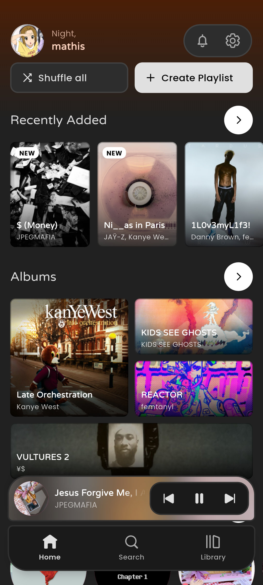
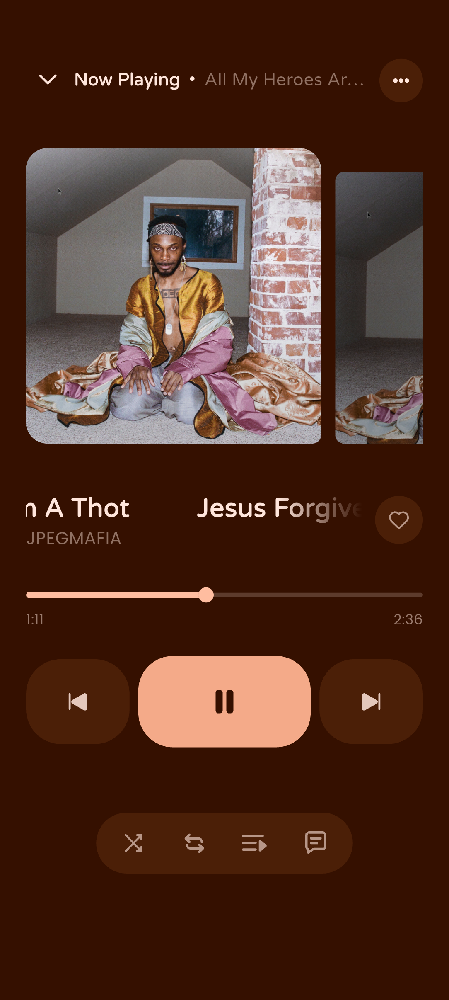

# Sono

<p align="center">
Welcome to this repository. It contains the full source code of the app.<br>
The app is new and currently in a very early stage.
</p>

<p align="center">
  
  
</p>

## What is Sono?

Sono is yet another local music player, it's cross platform and NOT material
design. Yes, I took inspiration from Material Design for the Fullscreen Player,
but I just like extracting colors from stuff and make them bouncy :]

It is built with Flutter and and has all the features you need.
Not yet, but soon :D

Good news: Sono even runs on a Samsung Galaxy Tab A6 from 2016!! :D

## Download

<p align="center">
<a href="https://apps.obtainium.page/redirect?r=obtainium://app/%7B%22id%22%3A%22wtf.sono%22%2C%22url%22%3A%22https%3A%2F%2Fgithub.com%2Fappsono%2Fsono-new%22%2C%22author%22%3A%22appsono%22%2C%22name%22%3A%22Sono%22%2C%22preferredApkIndex%22%3A0%2C%22additionalSettings%22%3A%22%7B%5C%22includePrereleases%5C%22%3Afalse%2C%5C%22fallbackToOlderReleases%5C%22%3Atrue%2C%5C%22filterReleaseTitlesByRegEx%5C%22%3A%5C%22%5C%22%2C%5C%22filterReleaseNotesByRegEx%5C%22%3A%5C%22%5C%22%2C%5C%22verifyLatestTag%5C%22%3Afalse%2C%5C%22sortMethodChoice%5C%22%3A%5C%22date%5C%22%2C%5C%22useLatestAssetDateAsReleaseDate%5C%22%3Afalse%2C%5C%22releaseTitleAsVersion%5C%22%3Afalse%2C%5C%22trackOnly%5C%22%3Afalse%2C%5C%22versionExtractionRegEx%5C%22%3A%5C%22%5C%22%2C%5C%22matchGroupToUse%5C%22%3A%5C%22%5C%22%2C%5C%22versionDetection%5C%22%3Atrue%2C%5C%22releaseDateAsVersion%5C%22%3Afalse%2C%5C%22useVersionCodeAsOSVersion%5C%22%3Afalse%2C%5C%22apkFilterRegEx%5C%22%3A%5C%22%5C%22%2C%5C%22invertAPKFilter%5C%22%3Afalse%2C%5C%22autoApkFilterByArch%5C%22%3Atrue%2C%5C%22appName%5C%22%3A%5C%22%5C%22%2C%5C%22appAuthor%5C%22%3A%5C%22%5C%22%2C%5C%22shizukuPretendToBeGooglePlay%5C%22%3Afalse%2C%5C%22allowInsecure%5C%22%3Afalse%2C%5C%22exemptFromBackgroundUpdates%5C%22%3Afalse%2C%5C%22skipUpdateNotifications%5C%22%3Afalse%2C%5C%22about%5C%22%3A%5C%22%5C%22%2C%5C%22refreshBeforeDownload%5C%22%3Afalse%2C%5C%22includeZips%5C%22%3Afalse%2C%5C%22zippedApkFilterRegEx%5C%22%3A%5C%22%5C%22%2C%5C%22includeTarballs%5C%22%3Afalse%2C%5C%22tarballedApkFilterRegEx%5C%22%3A%5C%22%5C%22%7D%22%2C%22overrideSource%22%3Anull%7D"></a><a href="https://play.google.com/store/apps/details?id=wtf.sono.app"></a><a href="https://github.com/appsono/sono-new/releases/latest"></a>
</p>

## Contributing

Contributions are welcome.
Simply open a pull request with your changes or an issue if you find any bugs
that weren't already reported.

If you're unsure about a change, open an issue first to discuss it.

<br>

See [TODO](TODO.md) for current progress and planned work.

---

## Translations

<a href="https://hosted.weblate.org/engage/sono/">
  
</a>

Sono is translated on [Weblate](https://hosted.weblate.org/projects/sono/).
Everyone can contribute to translations.

- **Source language:** English (`lib/l10n/translations/sono_en.arb`)
- **Translation format:** [Flutter ARB](https://docs.flutter.dev/ui/internationalization)
- **Component mask:** `lib/l10n/translations/sono_*.arb`

## Why the restart?

```md
Hello everyone,

I have made a decision about the future of Sono. I started making Sono almost a year ago (April 2025).
When I first created it, I could not have imagined how many people would be interested in it
and how much work I would end up putting into it.

However, there is an issue with Sono. Bugs are everywhere. Even if you do not notice them, I do.
The reason these bugs exist is because I learned Dart and the Flutter framework while developing Sono.
A lot of the code in Sono is held together with tape and hope.

Before making Sono open source, I rewrote the entire player backend, which improved performance.
However, doing this was extremely difficult because many parts of the app relied on the old implementation.

Because of this, I have decided to drop the current Sono codebase and restart it from scratch.
This time the project will be open source from the beginning. Do not worry, the UI will not change much.

Another reason for this rewrite is the overload of unfinished features.
With this rewrite I want to ensure that the app focuses on its core purpose: playing local music files.

I hope you understand this decision, and I will keep you updated.

Much love,
mathis
```

Originally announced on the [Discord server](https://discord.gg/48fvsUCNwu).

## Official Communities

Discord: [https://discord.gg/48fvsUCNwu](https://discord.gg/48fvsUCNwu)

Nerimity: [https://nerimity.com/i/sono](https://nerimity.com/i/sono)

Stoat/Revolt: [https://stt.gg/3chxJMWT](https://stt.gg/3chxJMWT)

## LICENSE

[GPLv3](LICENSE)
